# Live Website
[Visit the project website here](https://exploria-app.herokuapp.com/)

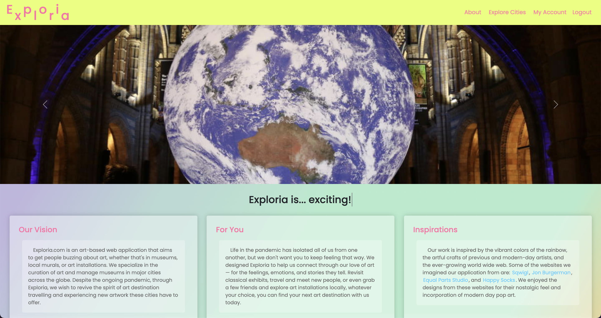

# Project 3: Wayfarer - Exploria

### Made by: Bryan Curtis, Gail Tyler, Elliot Harrison, Kathy Wu 

> An art exploration and social media application called Exploria. Using Django, Python, PostgreSQL, Bootstrap, and SASS, the application includes features like user account creation and editing, profile, posting content, and commenting.

## Table of Contents
* [Technologies Used](#technologies-used)
* [Features](#features)
* [Screenshots](#screenshots)
* [Planning](#planning)
* [User Stories](#user-stories)
* [Project Status](#project-status)
* [Room for Improvement](#room-for-improvement)
* [Acknowledgements](#acknowledgements)

## Technologies Used
- Bootstrap
- Django
- Python
- PostgreSQL
- SASS

## Features
Current ready features:
- User account creation
- User authentication and authorization
- User profile editing
- Posting content
- Replying to posts with comments

## Screenshots

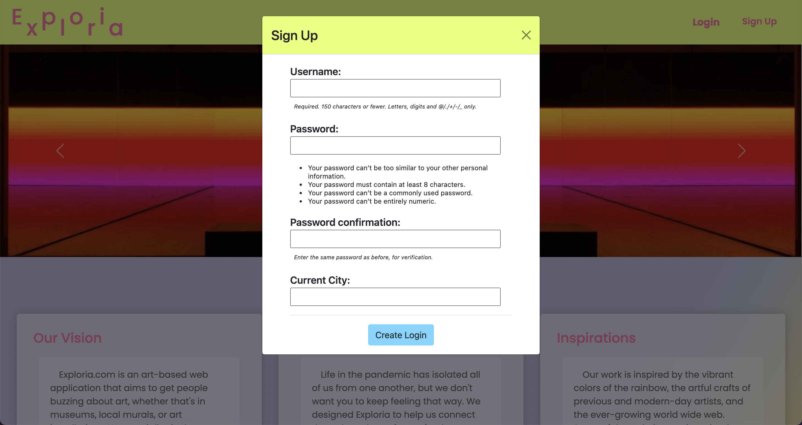
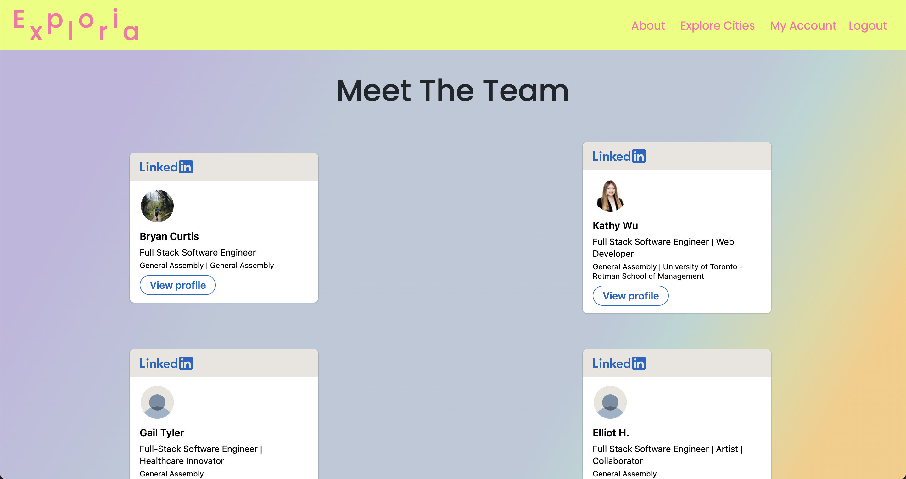
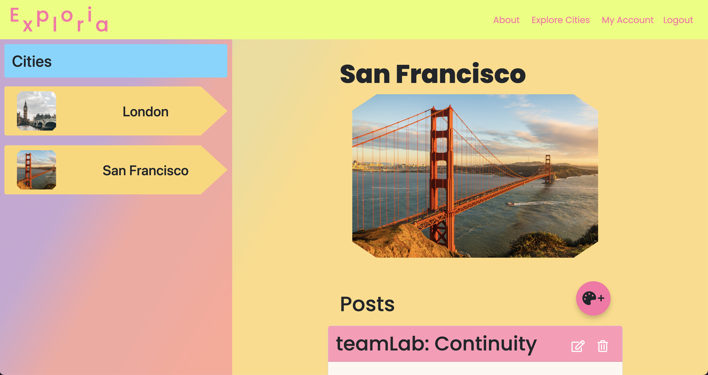
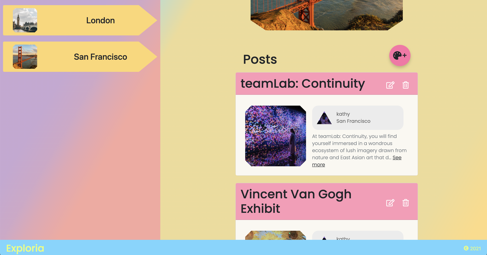
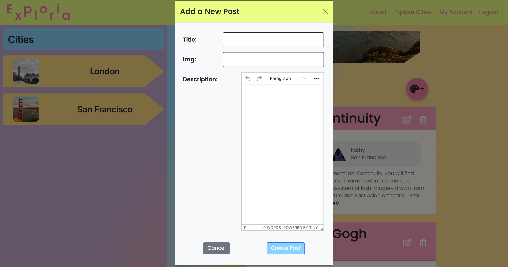
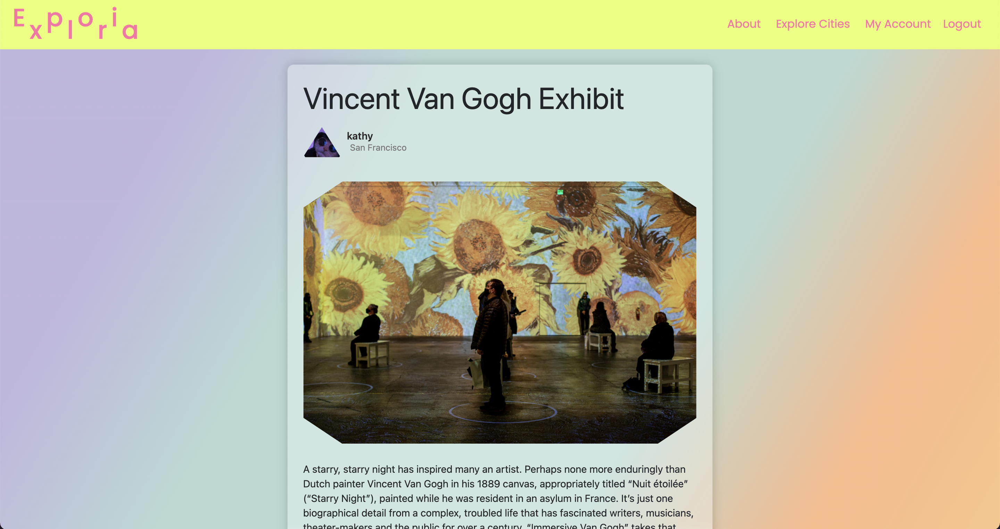
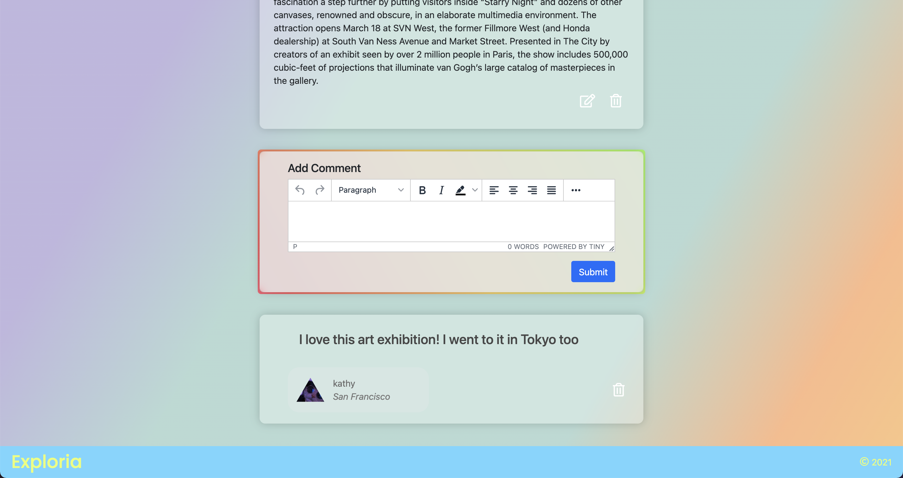
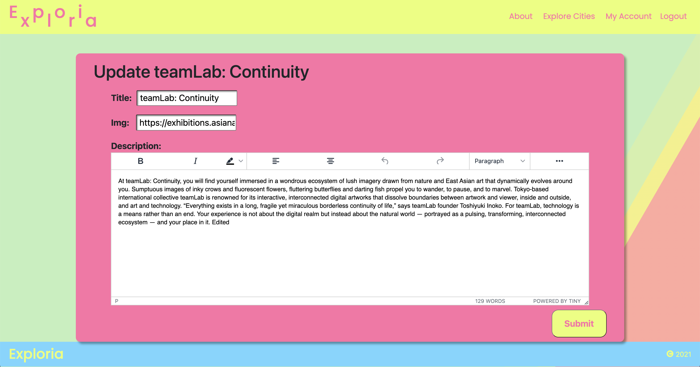
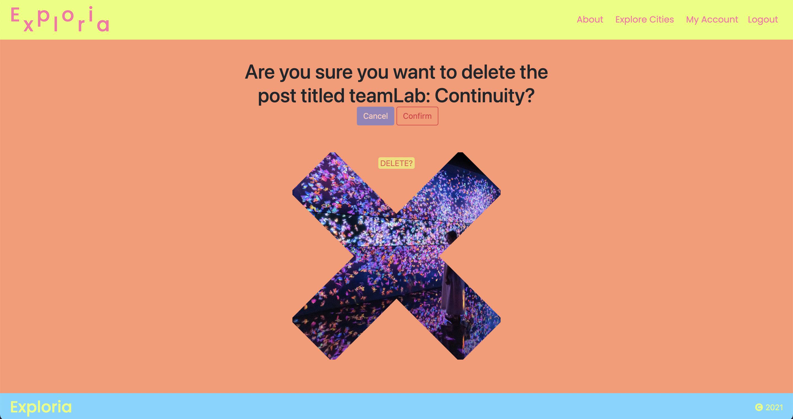
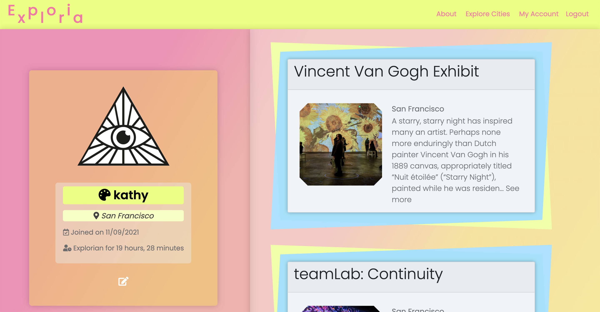

## Planning

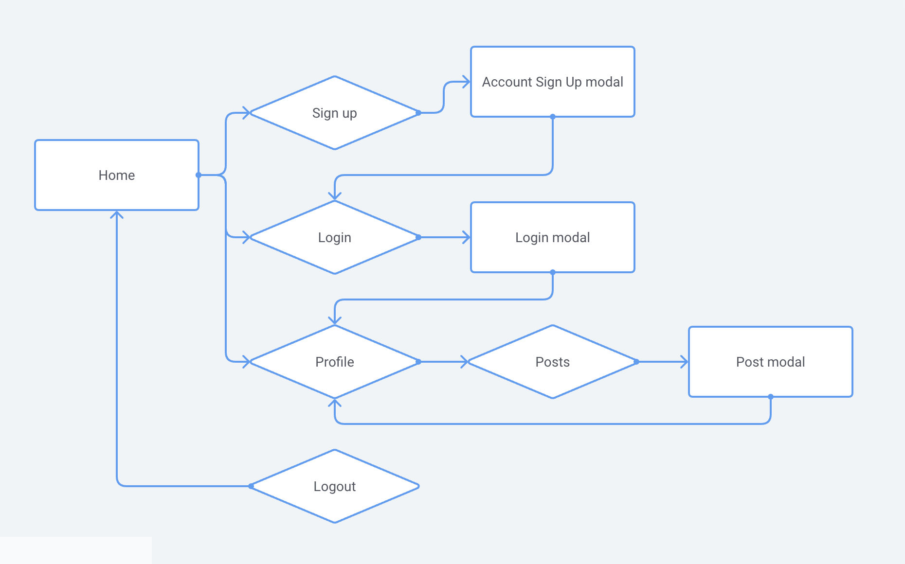
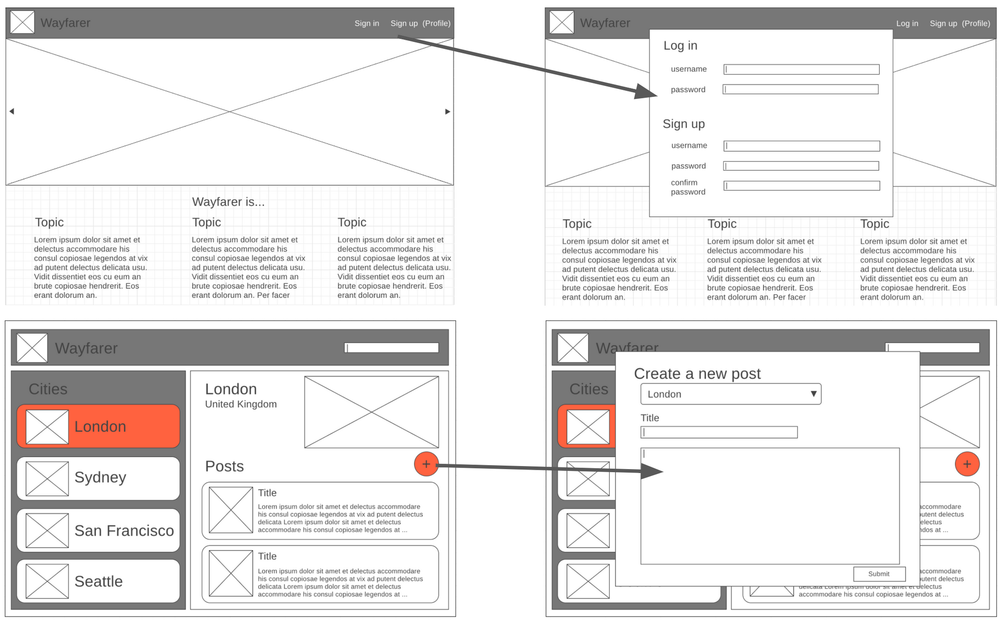
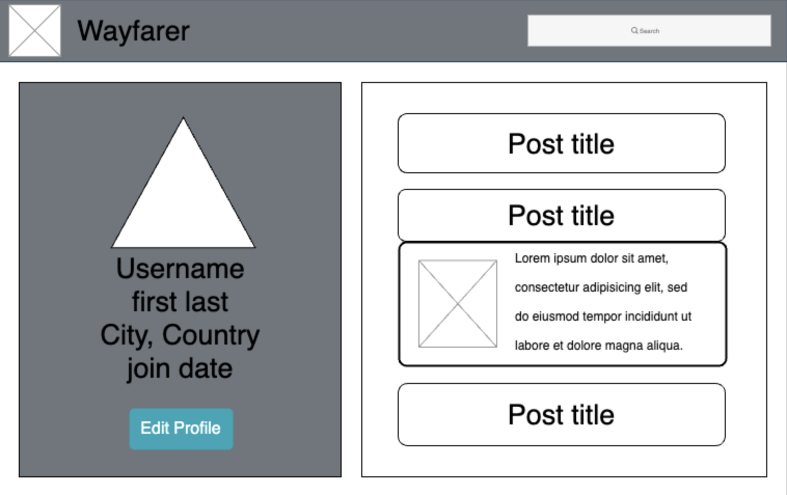
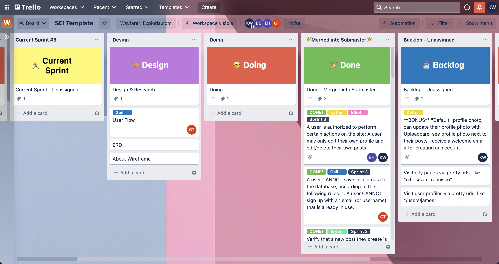

## User Stories
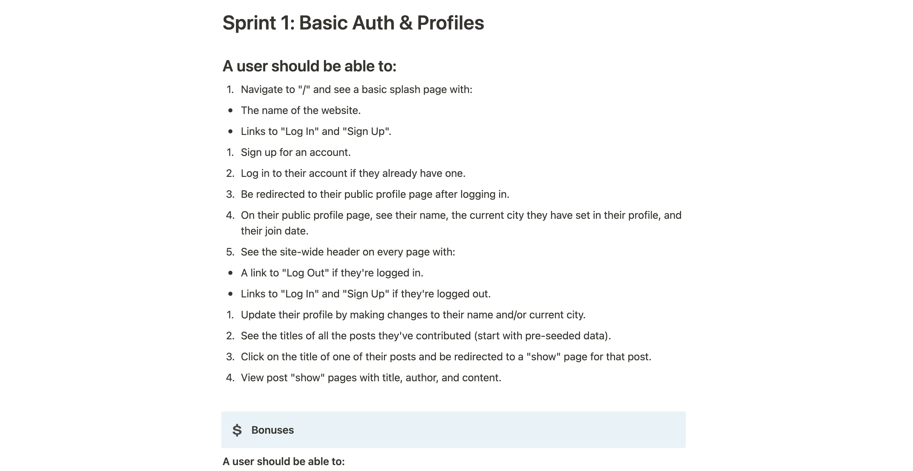
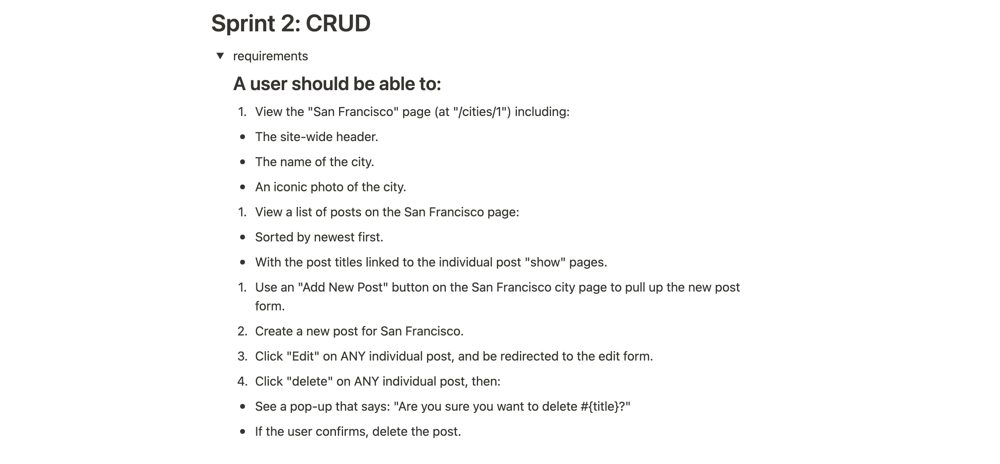
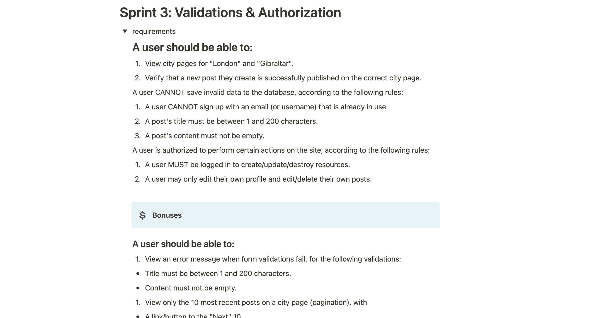
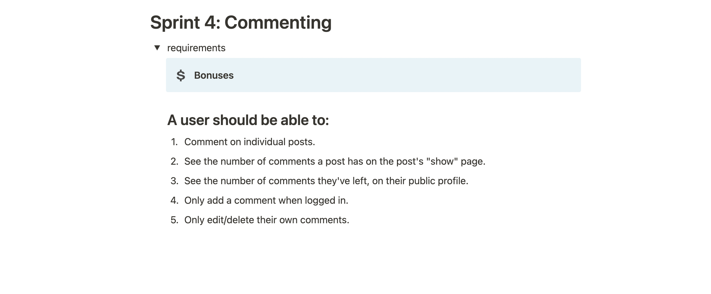

## Project Status
Project is: _complete_ 

## Room for Improvement

Room for improvement:
- Mobile Responsive

## Acknowledgements
- Amazing work done by our group
- Excellent support team from our instructor Dalton
- All the frontline staff who encourage us in General Assembly!

